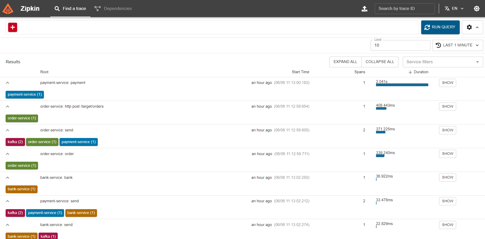

# Target Ready Demo 1

# Kafka Message Tracing with Zipkin and Grafana

## Problem Statement 
When a Kafka message goes to multiple microservices where each make some changes and enhancements, its hard to keep track of where it fails and what is the current status of a message.  Build a grafana dashboard which uses zipkin/jeager to track the message throughout its life cycle

## Overview

This demo project showcases Zipkin to trace Kafka messages across three microservices: `BankService`, `PaymentService`, and `OrderService`. The purpose is to demonstrate the need and use of a tracing system to monitor and debug message flows in a microservices architecture.

## Microservices Architecture

The project consists of three microservices:


1. **OrderService**: Receives customer orders and sends order messages
2. **PaymentService**: Receives order and sends payment messages
3.  **BankService**: Receives payment messages and sends invoices

Messages are exchanged between these services via Apache Kafka.

## Tracing System

### Zipkin

[Zipkin](https://zipkin.io/) is a distributed tracing system that helps gather timing data needed to troubleshoot latency problems in microservice architectures.

## Prerequisites

- Java 17 (for microservices)
- Maven (for building Java projects)

## Setup

1. **Clone the Repository**

   ```bash
   git clone https://github.com/pavankumar0715/TargetReadyDemo1.git
   cd TargetReadyDemo1/ecommerce-management
   ```

2. **Start the Environment**

   On 3 terminals, run the following:

   ```powershell
   .\bin\windows\zookeeper-server-start.bat .\config\zookeeper.properties
   ```

   ```powershell
   .\bin\windows\kafka-server-start.bat .\config\server.properties
   ```

   ```powershell
   java -jar .\zipkin-server-3.3.0-exec.jar
   ```

   This will start the following services:

   - Apache Kafka
   - Zipkin

3. **Build the Microservices**

Build and run the microservices

## Configuration

### Zipkin

Zipkin is configured to collect traces from the microservices. Each microservice is set up to send tracing data to Zipkin.

## Running the Demo

1. **Send Messages**
   You can use tools like Postman or cURL to send requests to the microservices. Here are some example requests:

   ```bash
     curl -X POST http://localhost:8080/target/orders -d
     '{"orderId": "1001","amount": 102.0,"bank": "SBI","stock": 5}' -H "Content-Type: application/json"
   ```


2. **View Traces**
   - Access Zipkin UI at `http://localhost:9411` to view the traces.

## Example Scenario

1. **Order Creation**: An order is created in the `OrderService`.
2. **Payment Processing**: The `PaymentService` processes the payment for the order.
3. **Bank Transaction**: The `BankService` processes the transaction and generates the invoice.

Each of these actions generates tracing data that is collected by Zipkin allowing you to see the flow of messages and identify any bottlenecks or issues.




## Conclusion

This demo project illustrates the importance of using a tracing system like Zipkin to monitor and debug message flows in a microservices architecture. By integrating Zipkin with Grafana, you gain powerful visualization capabilities to enhance your observability and troubleshooting efforts.

## References

- [Zipkin Documentation](https://zipkin.io/pages/documentation.html)
- [Apache Kafka Documentation](https://kafka.apache.org/documentation/)
